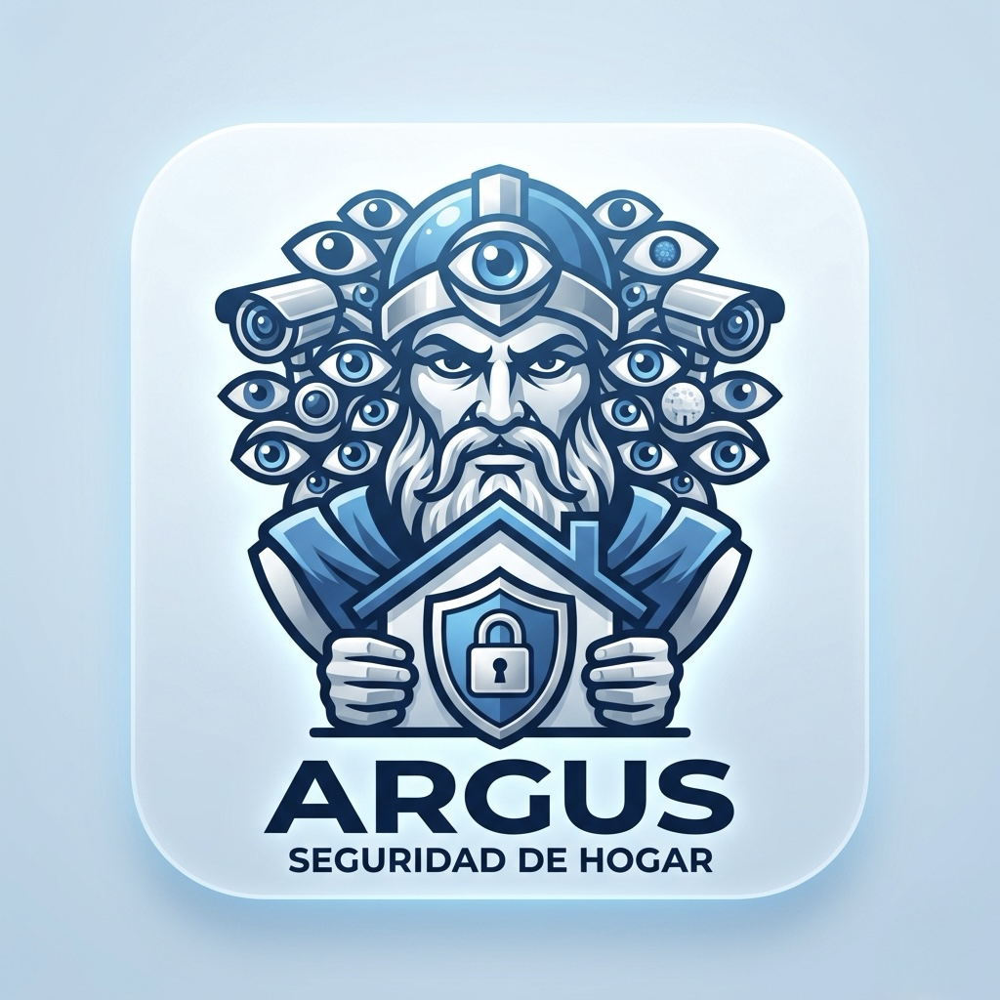

# 🛡️ Argus

### Premium Smart Alarm & Security Panel for Home Assistant

**Argus** is a powerful, elegant, and privacy-first alarm system for Home Assistant.  
Designed to go far beyond a simple alarm panel — Argus brings security, guest access, audit trails, automation, and a glass-style UI all in one unified experience.

---

*"Security should feel as polished as the home it protects."*

---

## ✨ Why Argus?

Most Home Assistant alarm integrations are functional but bare. **Argus is different.**

Built from the ground up with a premium UI, multi-zone logic, guest access management, and a smooth glass-style control panel, Argus is designed for people who want both **real protection** and **real elegance**.

Whether you're protecting a smart apartment, a family home, or a professional space — Argus adapts to your needs.

---

## 🔐 Core Features

- **🏠 Multi-zone alarm system** — arm, disarm, and configure each area independently
- **👤 Guest access management** — create temporary or permanent access with PIN and NFC tag support
- **📋 Full audit history** — every action is logged with timestamps, user, and device
- **🌙 Light & Dark Mode** — a beautiful Liquid Glass-inspired UI, auto-synced with your system theme
- **📱 Mobile-first panel** — designed for tablets, phones, and wall-mounted displays
- **🔔 Smart notifications** — TTS announcements, push alerts, and custom automations
- **🔒 Device-aware sessions** — guest sessions are tied to devices, not just PINs
- **🌡️ Integrated controls** — manage lights, locks, climate, and cameras from the same panel
- **🌍 Multi-language** — English and Spanish included out of the box
- **⚡ Fast & offline-capable** — works even when your internet is down

---

## 🛡️ Security Philosophy

Argus is built with a **secure-by-default** mindset:

- All access is role-based (admin, resident, guest, emergency)
- Actions are logged and non-repudiable
- Token-based guest sessions expire automatically
- No cloud dependency — your data stays in your home
- Audit history is tamper-resistant and stored locally

> Argus does not promise to be unhackable — no system is. What it promises is transparency, control, and resilience.

---

## 📦 Installation via HACS

1. Go to **HACS → Integrations**
2. Click the three dots menu (⋮) → **Custom repositories**
3. Add: `https://github.com/Chrisalvir1/argus`
4. Select category: **Integration**
5. Search for **Argus** and click **Install**
6. Restart Home Assistant
7. Go to **Settings → Integrations → Add Integration → Argus**

---

## 🌐 Languages

| Language | Status |
|---|---|
| English | ✅ Full |
| Español | ✅ Completo |

---

## 🗺️ Roadmap

- [x] Core alarm control panel entity
- [x] Multi-zone support
- [x] Guest access with PIN
- [x] Audit history
- [ ] NFC tag integration
- [ ] Lovelace card (Argus Card)
- [ ] Mobile companion optimizations
- [ ] Voice assistant hooks (Assist)

---

## 💬 Suggestions & Feedback

Have an idea, found a bug, or want to help improve Argus?

📧 **Email:** [chrisalvir01@gmail.com](mailto:chrisalvir01@gmail.com?subject=Argus%20Suggestion)

Or open a [GitHub Issue](../../issues) — all feedback is welcome.

---

## 👤 Created by

**Christopher Alvir**

*Developer · Home Automation Enthusiast · Creator of Argus*

*Building tools that make smart homes feel truly smart.*

---

## ☕ Support the Project

Argus is free, open-source, and built with love during personal time.

If it helps protect your home, saves you time, or just makes your Home Assistant setup feel more premium — consider supporting the project with a coffee.

*Every coffee is a thank-you that fuels the next feature.* ❤️

---

## 📄 License

Argus is licensed under the [MIT License](LICENSE).  
You are free to use, modify, and distribute it — with attribution.

---

*Made with ❤️ in Costa Rica · by Christopher Alvir*

