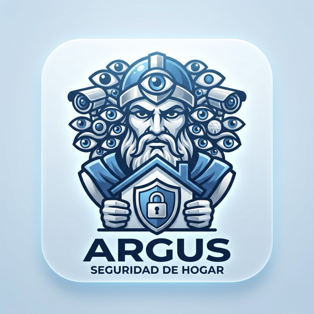

<div align="center">
  

# Argus Home Hub

**Panel de alarma local-first para Home Assistant**

[](https://github.com/Chrisalvir1/Argus/releases)
[](https://github.com/Chrisalvir1/Argus/actions/workflows/validate.yml)
[](https://hacs.xyz/)
[](LICENSE)

</div>

Argus reúne alarma, sensores, sirenas, auditoría, acceso mediante PIN, notificaciones y una interfaz Liquid Glass en una integración para Home Assistant. El procesamiento principal es local y no requiere un servicio cloud de Argus.

> [!IMPORTANT]
> Argus no sustituye una alarma certificada ni garantiza comunicación con servicios de emergencia. Prueba siempre tus sensores, sirenas y métodos de respaldo.

## Funciones

- Modos desarmado, casa, ausente, noche y vacaciones.
- Retardos de entrada, salida y duración de alarma.
- Detección de sensores abiertos y bypass controlado.
- Switch SOS compatible con automatizaciones y exportaciones de Home Assistant.
- Recuperación del último estado estable después de un reinicio.
- MQTT opcional para estado y comandos.
- Auditoría y línea temporal forense local.
- Panel completo y tarjeta Lovelace compacta.
- Fondos meteorológicos y soporte multilenguaje.

## Requisitos

- Home Assistant **2024.7.0 o posterior**.
- HACS recomendado.
- Cuenta administradora para instalar y configurar.

## Instalación con HACS

1. Abre **HACS → Integraciones**.
2. Selecciona **Repositorios personalizados**.
3. Añade `https://github.com/Chrisalvir1/Argus` como **Integración**.
4. Instala **Argus Home Hub**.
5. Reinicia Home Assistant.
6. Abre **Ajustes → Dispositivos y servicios → Añadir integración** y busca **Argus**.
7. Recarga completamente el navegador para actualizar los recursos del frontend.

## Instalación manual

1. Descarga `argus.zip` desde la última release.
2. Copia su contenido a `custom_components/argus`.
3. Reinicia Home Assistant y añade la integración desde la interfaz.

## Lovelace

### Tarjeta compacta

```yaml
type: custom:argus-card
entity: alarm_control_panel.argus
title: Seguridad
```

### Panel completo

```yaml
type: custom:argus-panel
```

## Seguridad

- Los PIN se almacenan con `scrypt` y salt aleatorio.
- Usa un PIN único de 4 a 12 dígitos; evita secuencias y repeticiones.
- No compartas respaldos o registros sin redactar.
- Los archivos ubicados en `/config/www` se sirven mediante `/local` y no deben considerarse privados.
- Reporta vulnerabilidades siguiendo [SECURITY.md](SECURITY.md).

## Actualización segura

1. Crea un respaldo de Home Assistant.
2. Actualiza desde HACS.
3. Reinicia Home Assistant.
4. Recarga el navegador.
5. Verifica armado, desarmado, sensores, sirena, SOS y notificaciones.

## Solución de problemas

- **El panel no cambia:** recarga el navegador sin caché.
- **La integración no aparece:** confirma que existe `custom_components/argus/manifest.json` y reinicia HA.
- **Una entidad está unavailable:** revisa el registro de Home Assistant y la configuración de la instancia.
- **HACS rechaza el repositorio:** confirma que seleccionaste la categoría Integración.

## Desarrollo

```bash
python -m compileall -q custom_components/argus
python -m unittest discover -s tests -v
node --check custom_components/argus/www/argus-card.js
node --check custom_components/argus/www/argus-panel.js
```

Consulta [CONTRIBUTING.md](CONTRIBUTING.md), la [API de extensiones](docs/EXTENSIONS_API.md) y el [registro de mejoras 1.6.0](docs/CHANGESET_1.6.0.md).

## Licencia

MIT. Consulta [LICENSE](LICENSE).

<div align="center">
Desarrollado por Christopher Alvir · Costa Rica
</div>
